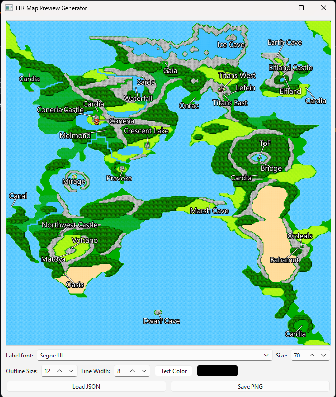

## Map Previewer for Final Fantasy Randomizer

This is a simple python app using QT6 to generate labeled images of .json maps created for [Final Fantasy Randomizer](https://finalfantasyrandomizer.com).
Text labels can be click+dragged around to reposition.
I used this project as an excuse to play around with Google Antigravity and as a result is almost entirely AI generated. Published under the MIT license.

